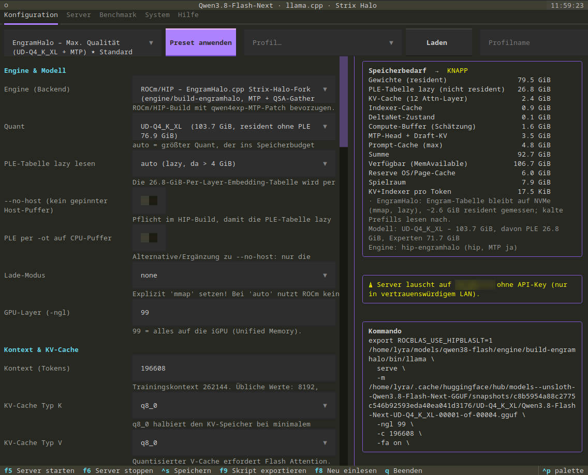

# qwen38-flash

> **Hinweis:** Der Großteil dieses Repositorys (Programm, Build- und Benchmark-Skripte, Recherche, Dokumentation und
> Website) wurde von Claude Fable 5.1 (Anthropic) erstellt, gesteuert und geprüft durch den Autor. Die Messwerte stammen
> von echten Läufen auf der beschriebenen Hardware.

Ein Terminal-Programm, mit dem du **Qwen3.8-Flash-Next** auf einem **AMD Strix Halo** Rechner
(Ryzen AI MAX+ 395 / Radeon 8060S, 128 GB Unified Memory) mit **llama.cpp** einrichtest, startest,
überwachst und misst. Es nimmt dir die Entscheidungen ab, die bei diesem Modell schwierig sind:
Welcher Quant passt in den Speicher? Welche Startparameter sind sinnvoll? Läuft spekulatives
Decoding (MTP)? Wie viele Nutzer gleichzeitig?

Alles ist auf einer solchen Maschine gemessen. Die Ergebnisse und die Begründungen stehen in
`docs/RESEARCH.md`.



## Was das Programm kann

- **Konfigurieren**: Modell-Quant, Kontextlänge, KV-Cache, Batch-Größen, MTP-Draft-Head, Thinking-Modus,
  Sampling, Netzwerk. Rechts siehst du sofort den geschätzten Speicherbedarf und die fertige Kommandozeile.
- **Speicher schützen**: Der Start wird verweigert, wenn die Konfiguration nicht in den Speicher passt.
  Ein Wächter stoppt den Server, bevor der Kernel wegen Speichermangel Prozesse abschießt.
- **Starten und beobachten**: Server-Log, Ladezeit, Puffergrößen, Tokens pro Sekunde, Akzeptanzrate des
  Draft-Heads, Test-Prompt.
- **Messen**: `llama-bench`, Server-Messung mit MTP, automatische Suche nach den besten MTP-Einstellungen
  und ein Mehrnutzer-Test mit bis zu 8 gleichzeitigen Anfragen.
- **Exportieren**: Startskript und systemd-Unit für den Betrieb ohne das Programm.
- **Presets**: fertige Konfigurationen für maximale Qualität, Geschwindigkeit, langen Kontext, Chat ohne Thinking.

Das Programm ändert nichts an deinen Modell-Dateien und nichts außerhalb seines eigenen Ordners.

## Voraussetzungen

| Was | Warum |
| --- | --- |
| AMD Strix Halo (gfx1151) mit 128 GB, Linux | dafür ist alles gemessen; andere Rechner mit viel Unified Memory sollten funktionieren, sind aber nicht getestet |
| ROCm/HIP 7.x mit `clang++`, `cmake`, `ninja`, `git` | zum Bauen der zwei llama.cpp-Varianten |
| Kernel-Parameter `amd_iommu=off amdgpu.gttsize=126976 ttm.pages_limit=32505856` | sonst darf die GPU nur einen Teil des RAM benutzen |
| Python 3.12 oder neuer, [uv](https://docs.astral.sh/uv/) | für das Terminal-Programm |
| `hf` (Hugging-Face-CLI) | zum Herunterladen der Modelle |
| ca. 200 GB freier Platz auf einer schnellen NVMe | Modelle 73 bis 104 GB pro Quant |

## Installation

```bash
git clone <URL dieses Repos> qwen38-flash
cd qwen38-flash
uv sync                      # legt .venv an und installiert Textual & Co.
```

### Modelle laden

```bash
# Bester Quant, der mit MTP in 128 GB passt (Engine EngramHalo):
hf download unsloth/Qwen3.8-Flash-Next-GGUF --include 'UD-Q4_K_XL/*'
# Kleinere Alternativen:
hf download unsloth/Qwen3.8-Flash-Next-GGUF --include 'UD-IQ4_XS/*'
hf download unsloth/Qwen3.8-Flash-Next-GGUF --include 'UD-IQ3_XXS/*'
# MTP-Draft-Head (nur dieser passt zu den Builds hier):
hf download dzannotti/Qwen3.8-Flash-Next-MTP-GGUF Qwen3.8-Flash-Next-MTP-Q4_K_M.gguf
```

Das Programm findet die Dateien im Hugging-Face-Cache von selbst. Liegen sie woanders, setze
`QWEN38_MODEL_DIRS=/pfad/a:/pfad/b` und `QWEN38_MTP_DIRS=/pfad/mtp`.

### Engines bauen

```bash
engine/fetch.sh                 # holt llama.cpp und EngramHalo.cpp aus öffentlichen Repos und patcht sie
engine/build-engramhalo.sh      # empfohlene Engine (Strix-Halo-Fork)
engine/build.sh hip             # zweite Engine: llama.cpp + MTP-Patch
```

Beide Builds landen unter `engine/build-*/bin/`. Einen eigenen llama.cpp-Build meldest du mit
`QWEN38_ENGINES=name=/pfad/zu/llama` an.

## Benutzung

```bash
./run.sh                        # Terminal-Programm
./run.sh presets                # alle Presets
./run.sh show --preset eh-qualitaet    # Kommandozeile und Speicherbilanz anzeigen
./run.sh run  --preset eh-qualitaet    # Server ohne Programm starten
./run.sh bench-parallel --users 8      # Mehrnutzer-Benchmark ohne Programm
```

Im Programm: Preset wählen und „Preset anwenden“ drücken. Rechts stehen Speicherbilanz und Kommando.
**F5** startet den Server, **F6** stoppt ihn, **F9** exportiert ein Startskript, **Ctrl+S** speichert
die Konfiguration. Tabs: Konfiguration, Server, Benchmark, System, Hilfe.

Der Server ist danach unter `http://<host>:8080` mit der OpenAI-kompatiblen API erreichbar
(`/v1/chat/completions`), inklusive Web-Oberfläche von llama.cpp.

## Die wichtigsten Erkenntnisse

**Speicher.** Jeder Quant enthält dieselbe 26,8 GB große Tabelle für n-Gram-Embeddings. Normales
llama.cpp lädt sie auf ROCm komplett in den RAM, zusätzlich zu den Gewichten in der GPU. Deshalb passt der
beste Quant (UD-Q4_K_XL) mit MTP dort nicht in 128 GB. Der Fork **EngramHalo.cpp** lässt die Tabelle auf der
NVMe liegen (nur ca. 3 GB im RAM) und lädt trotzdem in unter 30 Sekunden. Damit läuft UD-Q4_K_XL mit MTP
bei etwa 85 GB Speicherbedarf.

**Geschwindigkeit** (ein Nutzer, 32k Kontext, KV-Cache q8_0):

| Engine | Quant | MTP | Decode | Speicher |
| --- | --- | --- | --- | --- |
| EngramHalo | UD-Q4_K_XL | an | 33–41 t/s | 85 GB |
| EngramHalo | UD-IQ4_XS | an | 36 t/s | 69 GB |
| EngramHalo | UD-IQ3_XXS | aus / an | 23 / 34 t/s | 53 / 57 GB |
| llama.cpp + Patch | UD-IQ4_XS | an | 34 t/s | 93 GB |
| llama.cpp + Patch | UD-Q4_K_XL | an | passt nicht | über 107 GB |

**Mehrere Nutzer** (UD-IQ4_XS, ohne MTP): 1/2/4/8 gleichzeitige Anfragen ergeben 20/32/42/50 Tokens pro
Sekunde insgesamt. MTP lohnt sich nur bei einem Nutzer; bei 8 Nutzern sind es mit MTP nur 35 statt 50 t/s.

**Weitere Entscheidungen**: ROCm statt Vulkan (Vulkan bricht mit MTP bei diesem Modell ein). Nur der
dzannotti-MTP-Head passt zu den Builds; der unsloth-Head braucht den unsloth-Fork. Die Umgebungsvariable
`LLAMA_ATTN_ROT_DISABLE` ist nicht nötig. `reasoning_effort` kennt nur `xhigh`, `medium` und `low`.

## Ordner

| Pfad | Inhalt |
| --- | --- |
| `qwen38tui/` | das Programm (Konfiguration, Speicherschätzung, Modell-Erkennung, GGUF-Reader, Server-Steuerung, Benchmarks, Oberfläche) |
| `engine/` | `fetch.sh`, Build-Skripte, Patches; nach dem Bauen `build-engramhalo/` und `build-hip/` |
| `bench/` | Mess-Skripte mit Speicher-Wächter und die Rohergebnisse dieser Maschine |
| `docs/` | `RESEARCH.md` (Recherche mit Quellen), `HILFE.md` (Hilfe im Programm) und die Dokumentations-Website (HTML, wird über GitHub Pages aus diesem Ordner veröffentlicht) |
| `tests/` | `uv run pytest -q` |
| `state/` | eigene Profile, Logs, Messergebnisse (wird beim ersten Start angelegt) |

## Dokumentations-Website

Der Ordner `docs/` enthält eine statische Website mit allen Entscheidungen, Messungen und Quellen
(`index.html`, `entscheidungen.html`, `speicher.html`, `benchmarks.html`, `anleitung.html`, `recherche.html`).
Veröffentlichen: in den Repository-Einstellungen unter „Pages“ den Branch `main` mit dem Ordner `/docs` wählen.
Es ist kein Build-Schritt nötig; `.nojekyll` sorgt dafür, dass GitHub die Dateien unverändert ausliefert.

## Bekannte Grenzen

- Nur mit ROCm/HIP auf gfx1151 getestet. Ein Vulkan-Build ist vorbereitet, aber nicht gemessen.
- MTP mit mehreren Slots ist auf dieser Architektur nicht gut; das Programm schaltet es im
  Mehrnutzer-Test ab.
- Der Speicherbedarf wird geschätzt. Die Schätzung ist auf die Messungen kalibriert, kann aber bei
  ungewöhnlichen Einstellungen abweichen. Der Wächter fängt das ab.
- Die MTP-Unterstützung für dieses Modell ist in llama.cpp noch nicht enthalten. Die Patches hier
  folgen den offenen Pull Requests und müssen bei neuen llama.cpp-Versionen angepasst werden.

## Dank

- [llama.cpp](https://github.com/ggml-org/llama.cpp) und die Autoren der qwen4exp-Unterstützung
- [EngramHalo.cpp](https://github.com/Aristo94/EngramHalo.cpp) für den Strix-Halo-Fork
- [dzannotti](https://huggingface.co/dzannotti/Qwen3.8-Flash-Next-MTP-GGUF) für den MTP-Draft-Head und den Patch
- [unsloth](https://huggingface.co/unsloth/Qwen3.8-Flash-Next-GGUF) für die Quantisierungen
- [Qwen](https://huggingface.co/Qwen/Qwen3.8-Flash-Next) für das Modell
- [Textual](https://textual.textualize.io/) für die Terminal-Oberfläche

## Lizenz

Dieses Projekt steht unter der **European Union Public Licence v. 1.2 (EUPL-1.2)**, siehe `LICENSE`.
Die Modelle, llama.cpp, EngramHalo.cpp und die Patches Dritter stehen unter ihren eigenen Lizenzen.
